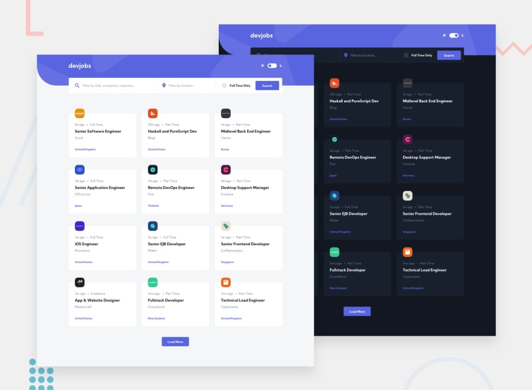

# Frontend Mentor - GITHUB JOBS Solution

This is a solution to the [Devjobs web app challenge on Frontend Mentor](https://www.frontendmentor.io/challenges/devjobs-web-app-HuvC_LP4l). Frontend Mentor challenges help you improve your coding skills by building realistic projects.

## Table of contents

- [Overview](#overview)
  - [About the project](#the-challenge)
  - [Screenshot](#screenshot)
  - [Links](#links)
- [My process](#my-process)
  - [Built with](#built-with)
  - [What I learned](#what-i-learned)
  - [Continued development](#continued-development)
  - [Useful resources](#useful-resources)
- [Author](#author)
- [Acknowledgments](#acknowledgments)

## Overview

### The challenge

Users should be able to:

- View the optimal layout for each page depending on their device's screen size
- See hover states for all interactive elements throughout the site
- Be able to filter jobs on the index page by title, location, and whether a job is for a full-time position
- Be able to click a job from the index page so that they can read more information and apply for the job
- Have the correct color scheme chosen for them based on their computer preferences.
- Websites for everyone with accessible HTML for most occasions

### Screenshot

### Links

- Solution URL: [Link](https://github.com/gerichilli/frontendmentor.io/tree/main/04%20devjobs-web-app)
- Live Site URL: [Github Jobs](https://github-jobs-filter.netlify.app/)

## My process

### Built with

- Semantic HTML5 markup
- CSS custom properties
- [Tailwind CSS](https://tailwindcss.com/) - CSS framework
- [React](https://reactjs.org/) - JS library

### What I learned

- How to use context in React
- How to use React Router
- How to write some custom hooks
- Get used to the utility-first CSS framework Tailwind CSS
- Decide whether to use css custom properties or tailwind css for the theme change
- Deploy React app on Netlify using command cli

### Useful resources

- [Creating custom themes with Tailwind CSS](https://blog.logrocket.com/creating-custom-themes-tailwind-css/)
- [How to deploy React Apps in less than 30 Seconds](https://www.netlify.com/blog/2016/07/22/deploy-react-apps-in-less-than-30-seconds/)
- [Tailwind CSS Configuration](https://tailwindcss.com/docs/configuration)

## Author

- Website - [Add your name here](https://www.your-site.com)
- Frontend Mentor - [@yourusername](https://www.frontendmentor.io/profile/yourusername)
- Twitter - [@yourusername](https://www.twitter.com/yourusername)
